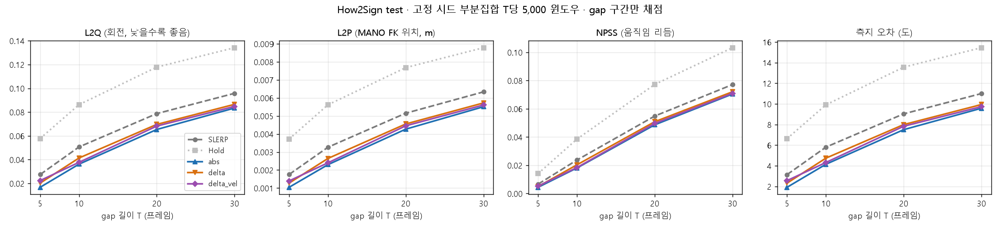
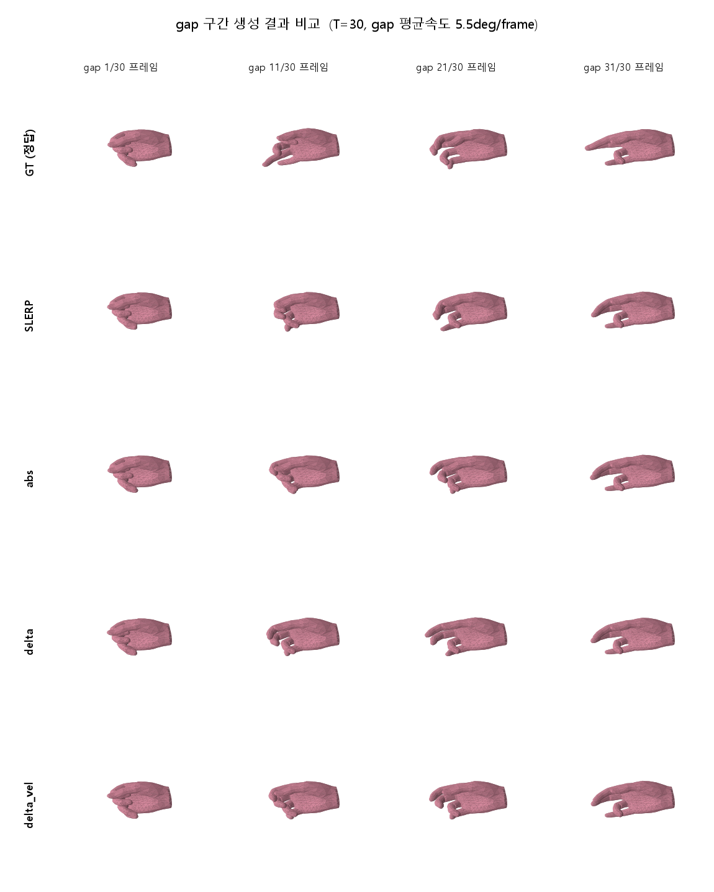

# Hand Motion In-betweening — 평가 하네스 · 기준선 · SILK 3종

KUBIG 26-1 DL 3팀 / 정지민 브랜치

- 팀에 없던 **SLERP 기준선**을 만들고, 그 위에서 **SILK 3종을 통제 실험**한 결과
- 평가: How2Sign test **전수 552,000 윈도우**, gap 구간만 채점
- 팀원 누구나 자기 모델을 얹어 **같은 조건으로 채점**할 수 있는 공용 하네스

---

## 1. 왜 만들었나

- 8/16 회의에서 "SLERP 대비 상대 개선율로 평가" 확정
- 그러나 **SLERP 수치 자체가 팀에 부재**
- 세 사람이 각기 다른 표본으로 평가 → 승패가 모델 차이인지 표본 차이인지 구분 불가

| 8/17~18 시점 보고 | split | n | 기준선 |
|---|---|---|---|
| diffusion | test 3% | 3,840 | 없음 |
| two-stage 1차 | dev | 320 | 없음 |
| two-stage 2차 | test 일부 | 15,360 | 없음 |

---

## 2. 결과 (test 전수)

### L2Q (낮을수록 좋음)

| 방법 | T=5 | T=10 | T=20 | T=30 |
|---|---|---|---|---|
| Hold | 0.0566 | 0.0850 | 0.1174 | 0.1354 |
| SLERP | 0.0272 | 0.0504 | 0.0789 | 0.0966 |
| **abs** | **0.0166** | **0.0361** | **0.0653** | **0.0839** |
| delta | 0.0200 | 0.0411 | 0.0694 | 0.0873 |
| delta_vel | 0.0222 | 0.0375 | 0.0680 | 0.0853 |

### SLERP 대비 개선율

| 방법 | T=5 | T=10 | T=20 | T=30 |
|---|---|---|---|---|
| **abs** | **+39.2%** | **+28.4%** | **+17.3%** | **+13.1%** |
| delta | +26.4% | +18.3% | +12.0% | +9.6% |
| delta_vel | +18.6% | +25.6% | +13.8% | +11.6% |



### 움직임비 (새로 만든 지표)

- 정의: `예측의 프레임간 평균 회전속도 / 정답의 그것`
- 1에 가까울수록 정답만큼 움직였다는 뜻. Hold가 0.001로 나오는 것이 정의의 sanity check

| 방법 | T=5 | T=10 | T=20 | T=30 |
|---|---|---|---|---|
| Hold | 0.001 | 0.001 | 0.001 | 0.001 |
| SLERP | 0.768 | 0.570 | 0.374 | 0.276 |
| **abs** | **0.906** | **0.756** | **0.533** | **0.409** |
| delta | 0.881 | 0.701 | 0.486 | 0.385 |
| delta_vel | 0.867 | 0.723 | 0.487 | 0.376 |

- **SLERP는 T=30에서 정답 움직임의 27.6%만 생성** — 두 끝점을 잇는 최단 경로라 중간 굴곡이 소실됨
- 그럼에도 L2Q에서 강한 이유: "덜 움직이는 것"이 L1 계열 오차에서 안전한 선택이기 때문
- → **L2Q만 보면 멈춰 있는 모델에 상을 주게 됨.** 두 지표를 병행해야 함



---

## 3. 모델 3종

세 모델의 **신경망 구조는 완전히 동일**(19,120,730 파라미터). 다른 것은 출력 해석 방식과 손실 항 하나뿐이라 통제 실험으로 성립.

| 이름 | 출력 방식 | 만든 이유 |
|---|---|---|
| `abs` | 회전값 90차원을 통째로 직접 예측 | SILK 재현. 기준점 |
| `delta` | SLERP 보간값 위에 얹을 보정값만 예측 | 학습 범위 밖에서 잔차만 버틴다는 팀 발견 검증 |
| `delta_vel` | delta + 프레임간 변화량 손실 | 멈춰 있으려는 경향 대응 |

- 공통: d=512 · 6층 · 8헤드, 50,000 스텝, 배치 128, L1 손실, 목표기준 상대 위치 인코딩
- `delta` 계열은 head 가중치를 0으로 초기화 → 학습 0스텝 시점 출력이 정확히 SLERP

### 입력 181차원

| 채널 | 차원 | 내용 |
|---|---|---|
| 상태 | 90 | MANO 15관절 x 6D 회전. gap 프레임은 0으로 지움 |
| 속도 | 90 | 앞 프레임과의 차이 |
| 관측 플래그 | 1 | context/target이면 1, gap이면 0 |

- **속도는 반드시 0-채움 이후에 계산.** 순서를 바꾸면 gap의 정답이 속도 채널로 새어 들어감

---

## 4. 자기 모델 얹는 법

```python
from pathlib import Path
from hmib.evaluate import evaluate, format_table, make_subset
from hmib.mano import ManoFK

index_path = Path("index/test_index.npz")
subset = make_subset(index_path)                  # 고정 시드 부분집합
# subset = make_subset(index_path, per_t=10**9)   # 전수 평가

def my_fill(batch):
    # batch: x (B,L,90) 정답, obs/valid (B,L) bool, rel (B,L), T (B,)
    # 반환: (B,L,90) 예측. gap 구간만 채점되므로 나머지는 아무 값이어도 됨
    return my_model(batch)

res = evaluate(my_fill, "test", index_path, subset, fk=ManoFK("RIGHT", device="cuda"))
print(format_table(res))
```

같은 시드를 쓰므로 **누가 돌려도 정확히 같은 윈도우**로 채점됩니다.

---

## 5. 실행 순서

```bash
pip install torch numpy scipy matplotlib lmdb huggingface_hub

python scripts/00_download.py           # How2Sign LMDB 8.9GB
python scripts/01_build_cache.py        # LMDB -> 연속 배열 캐시 + 인덱스 정합성 검증
python scripts/02_verify_data.py        # flip / 6D 규약 / 정규직교성
python scripts/02b_convention_test.py   # 6D 행-열 규약 결정 테스트
python scripts/03_baseline.py test      # SLERP / Hold 기준선
python scripts/04_train.py --variant abs --steps 50000
python scripts/05_evaluate.py           # 부분집합 평가 + 비교표
python scripts/10_fulltest.py           # 전수 평가
python scripts/06_visualize.py 30       # MANO 메쉬 비교 GIF
python scripts/07_extrapolate.py        # T=45 외삽
python scripts/08_plots.py              # 결과 그림
```

- `hmib/data.py`의 `DATA_ROOT`를 각자 LMDB 경로로 수정
- MANO는 `mano_v1_2.zip`에서 `assets/MANO_{RIGHT,LEFT}.pkl`로 압축 해제
  (**재배포 금지 라이선스라 저장소에 포함되어 있지 않음**)

---

## 6. 모듈 구성

| 파일 | 역할 | 외부 의존 |
|---|---|---|
| `hmib/rotation.py` | 6D / 행렬 / 쿼터니언 / axis-angle 변환, SLERP, 왼손 flip | torch |
| `hmib/mano.py` | MANO FK + LBS 메쉬 (smplx, chumpy 불필요) | torch, numpy |
| `hmib/metrics.py` | L2Q / L2P / NPSS / geodesic / 움직임비 (GPU 배치) | - |
| `hmib/data.py` | 캐시 빌드, Dataset, collate, 입력 특징 구성 | lmdb |
| `hmib/loader.py` | 학습용 고속 배치 샘플러 | - |
| `hmib/baselines.py` | SLERP / Hold | - |
| `hmib/models.py` | SILK 스타일 인코더 (abs / delta) | - |
| `hmib/evaluate.py` | 공용 평가 하네스 | - |

### smplx를 쓰지 않은 이유

- MANO pkl은 chumpy 객체를 담고 있고, chumpy는 Python 3.11+ 에서 import 자체가 불가 (제거된 `inspect.getargspec` 사용)
- pkl에서 순수 ndarray인 `J`, `kintree_table`, `v_template`, `posedirs`, `weights`만 읽어 FK와 LBS를 직접 구현
- betas=0이면 유일한 chumpy 값(`shapedirs`)이 쓰이지 않으므로 결과는 smplx와 동일
- 검증: 첫 뼈 길이 0.09064로 팀원이 smplx로 측정한 값과 일치

---

## 7. 검증 결과

- **6D 회전은 행 기준(pytorch3d)이 정답**
  - MANO 공식 `hands_mean`과 대조: 행 +0.79 / 열 -0.79 (15관절 중 14개 양수)
  - 열로 디코딩 시 검지가 97% 프레임에서 해부학적으로 불가능한 과신전
  - geodesic과 SLERP는 규약에 불변이나 MANO FK는 불변이 아니므로 L2P 계산에 확정 필요
- **왼손 flip 필요**
  - 손끝 프로필 편차 0.0179 → 0.0011 (16배 개선)
  - 단, flip은 L2Q / NPSS / geodesic을 전혀 변경하지 않음 (직교 켤레변환이라 회전 거리 보존)
  - 영향 범위는 L2P와 학습 품질뿐
- **평가 인덱스를 학습 루프에 쓰면 클립 경계 침범**
  - `dev/test_index.npz`의 `start`는 그 윈도우의 T 기준으로 설정됨 (T=5면 길이 16)
  - 학습에서 T를 다시 랜덤으로 뽑으면 최대 41프레임을 읽어 다음 클립을 정답으로 사용
  - dev의 8.4%(35,776 / 425,152) 해당. 배열 끝에서만 예외가 나고 나머지는 조용히 틀린 값 반환
  - `hmib/loader.py`가 41프레임 미확보 윈도우를 자동 제외
- **표본 크기**
  - 같은 SLERP를 시드만 바꿔 재추출 시 T=20에서 n=320은 ±4.3%, n=5,000은 ±0.4%
  - n=5,000 표본과 전수(552,000)의 실제 차이는 최대 0.6%
- **원본 6D는 이미 정규직교** (직교 이탈 7e-9) — 저장 손실 없음

---

## 8. 저장소 구성

```
hmib/       패키지
scripts/    00 다운로드 ~ 10 전수평가
index/      팀 공용 윈도우 인덱스 (train / dev / test)
results/    기준선·평가 JSON, 비교표, 학습 로그
figures/    지표 곡선, 외삽, MANO 메쉬 비교, 애니메이션
docs/       결과 정리 문서
```

`.gitignore` 제외 대상: MANO pkl(재배포 금지), 캐시 4.1GB, 체크포인트 219MB
